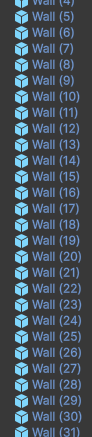
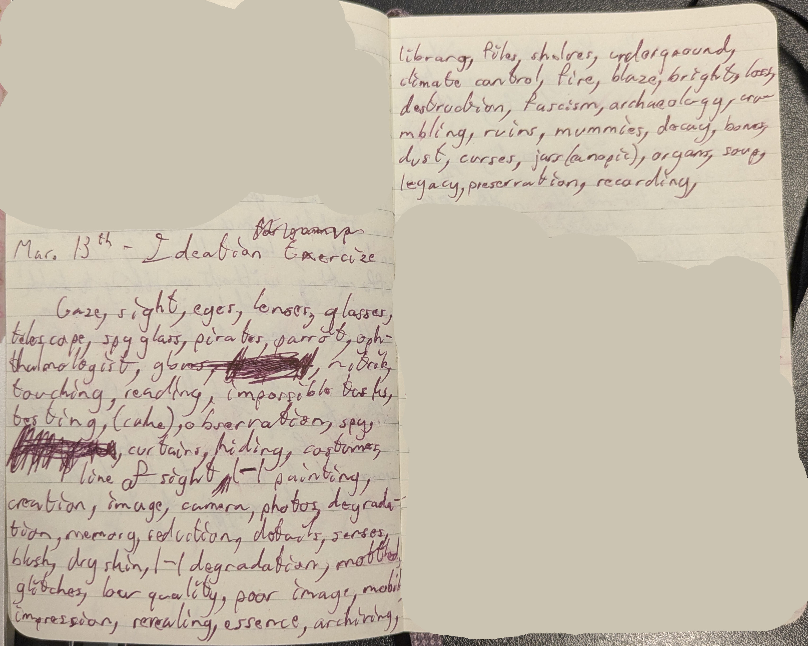

# Process Journal

## 23/01/25 | Make a thing assignment!

I've been thinking about ideas of faith, trust, and darkness this week, so that's what I decided to focus on for this first assignment.

I did admittedly have a busy week for non-school reasons, so this was a very quick thing.
I also haven't really used Bitsy for too long yet, so I wanted to start learning how it works.

I began with the idea of a previous Twine project I made where I tried to make links that blended in with the background and took attention to see.
I then tried to apply this to a lock and key system, which seems to be a core functionality in Bitsy.
Thus I came up with the idea of progressing through rooms with progressively harder to see objects one must gather to continue

In the end, I ended up spending too long figuring out how locks worked in Bitsy, and was only able to make two rooms, not allowing for much a "difficulty curve"

Still, I do feel like I have a better idea of how the tool works! Plus, it was nice to get to write a bit and make little sprites.

[game: Have Faith](https://github.com/eclectic-kitty/cart-315/tree/main/projects/makeAThing)

## 28/01/25 | Unity Exploration No. 1

I was watching a video on how the gravity in Super Mario Galaxy works and now I'm a bit curious about messing around with gravity, although I'm guessing that's something we'll look at in another week.

List of mechanics/features we looked at w/ possible experimentation directions
- Moving with keyboard keys
  - friction & slip?
  - ramp up?
  - run button?
  - joystick controls?
  - what if speed is jittery?
- collision detection
  - powerup to expand collision mask, ie make collector bigger
  - Add floor
    - items bounce!
- sprites
  - I wanna mess with the sprites somehow
  - Sprites that flicker to something else?
  - Sprites that scroll?
  - Sprites that have other images randomly flash over?
    - Ghostly
    - High transparecny

Process
- Starting with the sprites, giving falling items a sprite
  - For some reason my sprite is less bright in the game, probably a lighting thing?
    - Oh, it applies a color over the sprite? ok...
  - Where did this filename_0 copy come from?
    - My guess is it's a copy used for the object?
  - Okay, how would I do multiple sprites? 
    - Could I add a second sprite renderer to the same object? No :'(
    - Oh, I can add another sprite object!
    - The color can be used to manage transparency, and it looks pretty good!
  - A nested sprite mask object works nicely to keep it within the record
  - Now I want to make it flicker between different sprites.
    - List of sprites!
      - How to access different sprites from script?
      - It looks like I can make a list? and access it from the editor?
      - Or I can use a "resources" folder
      - Lists are funky in C#, curious about the <> tags, but I think I got it working!
      - For some reason, one of my sprites won't go in the list, but only problem so far!
    - Accessing sprites!
      - Welp, Sprite Renderer has a space -_-
      - Hmm, there are two randoms, making me have to specify which one...
      - Can't find the SpriteRenderer reference now...
      - App I have to use GetComponent? Strange...
      - Anyway, it's working! It's changing randomly!!!

Questions
- What's up with GetComponent?
- How do I get around there being a System.Random and a UnityEngine.Random?

## 06/02/25 | Unity Exploration No. 2

Stuff we did last week & possible directions
- 2D physics
  - Weight?
  - Bounciness?
  - Are there other parameters?
  - How can we mess with these parameters in-game?
- Sound
  - Sound coming from different places!
    - hide-and-seek?
    - hot or cold?
  - Can we do any generative sound?
  - Integrate a Max patch?
- Instancing
  - :p

Work!
- Trying to make a reference to the sprite renderer component in what I was doing last week
  - Not going well
  - Am confused
  - Do I know how to code???
  - Pain
  - (I can't quite figure out what type this variable needs to be? And looking up how to create a reference on Unity Docs is not currently being very helpful I fear)
- Abandoning that for now, like the hide-and-seek audio idea
  - Ideating
    - Spatial audio I don't think would work, given 2D, top down doesn't really make sense
    - Could modulate volume as you're closer or farther
    - could do labyrinth? Top-down?
    - Or maybe sidescrolling hiding in / behind things?
  - Set-up
  	- Made an object that can move around!
  	- Gave it audio!
  	- Accessing other objects...
  	  - Not sure I love how difficult it seems to be to do so from within scripts
  	  - Especially children!
  	  - Then again, not sure if I'm misremembering it being easier in Godot
  	  - Anyway, I'll just reference within the editor for now
  	  - Nevermind that didn't work...
  	  - That's as far as I got, alas.
  	  
## 12/02/25 | Unity Exploration No. 3
Alrighty, after being disappointed by the amouont of work I did last week, I'm devoting myself to making a Thing this week!
To keep things simple, I'm going to try and finish the idea I had last week, getting a limited aesthetics functional prototype with the following things

Features:
- Marco Polo
	- Spacebar causes player avatar to make a sound
	- It also causes the the hiding NPC to make a sound
		- This sound is attenuated by the distance between NPC and player
- Darkness
	- Only the immediate area around the player is visible
- Labyrinth
	- Walls! Lots of them!
	- Few dead ends, lots of paths
	
Having thought about this to make the list, I have ideas for potential future features I may be inclined to add and I wanna write them down so I don't forget.

Potential future ideas:
- Labyrinth
	- Wrap around
	- Specific spots that teleport the player
	- Labyrinth changes around player
	- Impossible spaces
	- Drastic changes in scale
	- A lot of these would probably require a camera that follows the player
- Marco Polo
	- Sound attenuated also by walls?
		- Or by pathfinding?
	- Different parts of the labyrinth have different quality?
		- Organic walls muffle sound more
	- Muffling in general! Different parts of a sound travel differently
	- Giving NPC ways of trying to trick the player...
- Darkness
	- Torches/fuel system...
		- Player starts to get disturbing effects, hallucinations, etc. 
		
Work:
- Reading player's distance
	- Attempting to use singleton method worked!
	- My autocomplete seems to be mostly broken, but alas. (it's not even automatically bracketing things? Debug.Log() isn't changing colour???)
	- In any case, i can read either my xLoc, yLoc variables, or transform.position so that's p cool.
	- Distance is simple with a built in function in the Vector3 class!
	- Still don't really understand what the hecc IEnumerator is...
	- It works!!!
    - Not well, mind u
    - The volume range Unity uses doesn't seem to be accounting for decibels being exponential I don't think?
    - The audible difference from like, 0.1 - 0.5 is not big
    - but the audible difference between 0.01 - 0.02 is
- Labyrinth
  - Oooh boy, designing and creating takes a while
  - Gotta figure out later how tiles works later. This was painful with so many different walls
  - But I have a labyrinth!

- uh oh, how do I make them solid...
    - Took a while to understand why the collision wasn't registering/working
      - Lots of forums online insisted the solidness would just work with the collider components
      - Then, once I realized I was going to have to handle this in the script, took a while to find out that you kinematic Rigidbodies don't register collisions with static rigidbodies...
    - Made a collision system that makes it really easy to get inside walls with reversed controls teehee
    - Following an online tutorial, used the Input component to make the player move with the RigidBody component, which then automatically collides with walls
  - Light, ie hiding everything not next to player
    - I initially tried just adding a sprite mask component to the player object... Didn't work??? Not not at all, but just, weirdly
    - In the end, I just made children
    - Discovered semi-transparency doesn't work with masks :'(
    - It's ok though, I just added an extra sprite with transparency
    - Anyway, I made a "darkness" that just overlays the entire screen but is not rendered within the mask that follows the player!

I think I'll leave it there for now. THe next thing to do would be to make the hider spawn in random places (and a win state :p) but I'm feeling pretty wiped out. I got really really stuck with the whole movement + collision thing. Also making the labyrinth the way I did was super time consuming, not to mention designing it in and of itself.

## 20/02/25 | Unity Exploration No. 4

Not too too much work this week!
I was hoping to figure out tilemaps **&** make a system to spawn the hider object, 
but I only got around to doing the latter (I had a bit of an anxious moment with an assignment for another class and it swallowed up my weekend and then some)
Anyway,

Work:
- Getting the hider object to spawn
	- I made a GameManager object!
	- Turned hider into a prefab
	- Now I can get GameManager to instance the hider at random spot
	- Initial attempt crashed the computer...
		- So many hiders...
		- added math to the randomness to not use the entire screen resolution as a range, but instead the grid
		- THis happened again later, but mostly stopped happening soooo who knows
- Getting hider object to not spawn inside of walls
	- Horrible, terrible
	- No idea why it refuses to register collisions without physics T_T
	- Worked eventually through some combination of physics bodies...

## 06/03/25

I like my labyrinth game! I think I'm going to focus on that moving forwards.
Also, I wanna switch back over to Godot, my beloved <3
Unfortunately, I'm not sure I remember all the details of how to use Godot...
So, I'm going to port over my current labyrinth game to Godot to reacquaint myself
(and learn tilesets while I'm at it so I don't spend as long recreating the labyrinth...

- Hi Godot!
	- lovelovelove the node tree system and how everything works here...
	- Also! Love that components aren't both separate objects or you can add them to an object! Hierarchical system where each component is a separate node feels so much more intuitive
	- Also! Accessing child nodes with a simple '$'!!! Magic!!! (It's a shorthand for a getNode function that takes a simple path along the hierarchy) (accessing parent nodes or nodes elsewhere that aren't children is a little tougher, but not tougher than in Unity)
- Tilemap
	- Ok this is so much simpler than I thought it would be...
	- The interface is not *the* most intuitive, but Godot's tutorial was p easy to follow and skip pas the bits I don't need to learn right now!
- Light
	- So, it turns out mask sprites are not a v well supported feature in Godot atm..
	- It does have a v easy to use built-in 2D lighting system...
		- But it's not super flexible...
		- I can't tint the darkness while keeping it opaque...
		- Shadows look sick!
			- But also it makes the walls the same black as the darkness..
	- Found some forums of people discussing various different ways of masking, as well as someone trying to make a similar darkness system to mine
	- Might also be a good moment to learn more about shaders
	
As I'm writing this during the lecture, am realizing haven't thought about the problem, the question, etc.
Or thinking of other ideas!
So that's going to be my first priority for next week:
- Developing conceptually a couple of other ideas
- Figuring out an end-of-semester goal (either developing a few prototypes or iterating on the same idea)
- Figuring out a goal for the week

## 13/03/25 - Iteration 2

### Random thoughts:
I saw a fun little trailer online for someone's horror game that utilized a webcam
The game scanned your face and could thus detect when you were in front of the monitor. This was partly used to unlock doors with "biometric" locks that scanned your face, but also the monster that chased you around would only get you if you were visible to the webcam.

I like the way this inverts the typical gaze. I might do some ideation for other ways in which I can make a game that does this to the typical player-game relationship.

#### Other examples I can think of:
- Kitty Horrorshow - hexcodes for black and red (I don't remember the codes)
	- The executable file is placed many layers deep inside folders with random strings of characters
	- The game also breaks the fourth wall by directly telling the player it wants them to leave, to stop playing, before closing the application itself.
- Doki Doki Literature Club
	- Similarly breaks the fourth wall
	- First by simply pretending to be a dating sim for a good few hours before turning into psychological horror
	- It does this partly with "glitches" and leaving files the player can look at in the game's files
	- Then having Monica become "sentient" and directly address the player
- Creepypasta!
	- Classic creepypasta setup
	- Mysterious .exe file with a twisted version of a popular game that begins to affect the player's life
- Not a game, but this makes me think of We're All Going to the World's Fair
	- Multiple scenes that are framed like YouTube videos, the main character talking directly to the camera
	- Also focuses how the online world affects the main character, how her gaze is turned back on her, *willingly*
	
Did some ideation in my notebook based on this, just some word association, but felt worth including:

Anyway, what's my feature goal today for the labyrinth

I like the idea of allowing the player to rely partly on sight at first, but making sound the only stable way of telling
- Hider camouflages itself
- Fake walls?
- Sudden dark patches
- Decoy hiders
- Endless corridors

### Work
- Tried for a bit to work on the lighting.
	- Mainly, get the light to illuminate the wall itself, but still cast shadows
		- Am realizing this is probs near impossible given that I want the maze to be entirely dark..
		- After all, how is the engine supposed to know that it can light the wall immediately next to the player, but not those farther away?
		- Certainly possible, but not in engine by default as I think this probably require visibility checks from the walls, ie, can I cast a ray directly to the player or is something else in the way?
		- Could be fun to implement but too much work for a simple aesthetic choice, I want to focus on gameplay more
			- Not a visual artist, so I won't be able to make a visual prototype to begin with
	- I'll have to pick either the shadows as they are, or the simple glow around the player I had previously
		- Going with former, as I like not being able to see a corridor until you are at the intersection
	- Might try coding a shader to tint pure darkness?
		- For future!

- I think i might focus on either giving the hider a bit more agency rn, or a darkness & sanity system
- Possible ways of giving hider agency:
	- Delaying response
		- Based on progression
		- Randomly
		- Based on sanity level
	- Disguising itself
		- camo?
		- Looking like an environment object? (would need more assets :'( )
		- straight up not being visible (seems unfair)
		- Sounding like something in the environment (would need more assets :'( )
	- Changing maze
		- Discounted earlier due to seeming difficult with randomness, but
		- Could prototype by having different versions of the quadrants or halves
		- These then get swapped out every once in a while
	- Decoy responses
		- These would have to be identifiable somehow
		- Pitch?
		- Could be more degraded
	- Mimics!
- Darkness and sanity
	- System
		- Certain sections have light
		- When outside of light sanity decreases
		- Player can walk around outside for a bit?
		- Or maybe they have limited torches, they can find more fuel?
	- Effects
		- See hider agency
		- Light goes out momentarily
		- Visuals or sounds change
		
- Want to port over hiders being able to respawn when found, keeping track of how many have been found, so as to have progression
- Want to implement the light/sanity system, no effects yet

## 20/03/25 - Iteration 3

I made it so that the hider can respawn! So that's nice

Features I could add this week:
- Sanity system (not sure it's worth it without effects planned...)
  - Could intensify hider's ability to mess with u, so both systems control it?
  - COuld introduce the things below at new levels, then sanity controls whether they happen or not
- Giving hider ways to mess with u due to progression
  - Hiders spawn in maze that don't make sounds, will end game if you try to catch them
    - Looking away makes them disappear? (Could either back up enough to make them disappear, or have a directional light)
  - Decoys spawn that make other noises when called (prototype: diff. pitches)
  - Hider begins to make other noises
- Time limit
  - Could be the thing you're acting against
  - Potentially too simple?
  - Not related thematically?
- Sounds!
  - feel prototype
  - I have ideas for the calls and responses
    - Thinking speech that is very garbled
    - Like through a phone? but more
    
Focusing on decoy hiders for now and levels
- Make the darkness only come in on level two
	- For now, I'm not creating new scenes for the levels as I'm keeping the same labyrinth
	- Instead, the root node counts how many times the Hider has been found
	- Thus, it makes the darkness node visible once the Hider has been found once
	- It also makes decoys start appearing on level 3
- Misc.
	- I added lights in the labyrinth itself! No sanity yet, but they're there for later
	- Had dimmed the player's light a bunch, but it looked too dim on my laptop screen, + it made the decoys and hiders only visible immediately in front of the player... So I mostly changed it back and made the torches' light a bit wider
- Make decoys!
	- Basic stuff
		- I decided to make a new scene for these, although they share a lot of code with the Hider...
		- I edited the spawn function in the root node's script so that it now accepts a preloaded scene
		- Thus, when called, I pass a reference to either the preloaded hider or decoy scene
		- Not sure how I want to handle the amount of decoys on screen, whether I want new ones each level, whether I want their number to increase, but I've just set it so it spawns new ones whenever one is deleted, and at the start of each level checks if there's the amount there should be (in case I make more later)
		- Game will end if you run into one of them instead of the hider
	- Response?
		- For now, I'm having them respond to the player as well, but pitched down
			- Came back to this later, making them not respond if seen
		- Made them randomize their delay as otherwise it got confusing :p
		- Might change this later, I like the creepiness of bumping into one but it not making any sound
	- Getting around them?
		- While thinking of whether I wanted the player to go all the way around them (admittedly annoying), I thought of Weeping Angels!
		- Not implementing weeping angel rules, but playing with when a monster is visible or not is fun, so they disappear if you back away from them after seeing them
			- To do this, I've implemented a second area in the player nodetree for the light,
			- Thus, the decoy checks for collision with the player's light, when inside it, it changes a variable
			- Then when the collision stops, the decoy disappears
- Game over
		- I made a game over screen!
		- The player is teleported to a new scene with no walls.
			- Currently there's a little grey flash in between...
			- A little bit of research about scene changes revealed to me that scene transitions can be done with shaders, so I'll have to look into that...
		- When the player calls, a hider is spawned beside them
		- The hider responds after a second, and the game then ends!
		- Currently did not want to do a menu screen, but also, I *have* always been a fan of games that turn themselves off... So I might keep it that way...

		
- Future thoughts
	- I feel like having to avoid the decoys kind of forces one to slow down as they're playing
		- Works as a surprisingly fun thing to play against
		- As mentioned below though, definitely still not clear enough to the player that they're dangerous
		- Also, it would certainly be easy for osmeone to just be very very careful when moving around
	- It could be good with a timer, but,
		- It ocurred to me that a limit of calls could be fun too!
		- Being able to check if the thing in front of you is a decoy or not could work very well with that
		- I should probs check both things
	- I do want to make the aesthetics a bit less default, could do very simple graphics and very distorted sounds, could do it in one week I think
	
- Bea thots
	- Scary! Ending!
		- Lights!
		- Could do to beginning as well
	- Decoy just looks like the real one, tone thing is a little too subtle
		- The player would want to just go for it
		- Bea thinks the balance of info is a little off rn
			- Possible differences: sound, visual, told information?
- Other thots from other peeps
	- Also found the ending a bit scarier
	- Difficulty scaling was nice!
	- Def need to give info on spacebar for audio cue
	- Didn't think to press audio cue later
	- Less ambient lights as u get further along?
	- Decoys not distinct enough!
	
## 27/03/25 - Iteration 4

This week I want to focus on look/feel prototyping the game

Specifically I would like to add audio, and if I have time, some text and visuals

### Goals?
#### Audio:
- Sounds for the player, hider, and decoys
- Ambient sounds
#### Text:
- Instructions for player (as dialogue from hider?)
#### sprites:
- walls
- player
- hider
- decoys

### Exploring sounds:
I began during last class by recording my voice and trying to distort it using:
- An EQ set to a telephony narrowband range
	- I like this! It definitely sounds like me, but I really like the imagery of phones and long distance communication that it conjures
	- It obvs still sounds like a voice however
	- I don't think I'll try it this week, but I could try using this as part of the distance-based effect that allows the player to find the hider, aside from simply volume
- Just a whole bunch of clipping
	- I definitely like hard clipping as a distortion effect, but it feels a bit too abrasive for the more creepy vibe I want, and my voice isn't all too obscured either
- Some other kind of distortion that tbh I forgot what it was
	- Sounds like a ray gun 😪
	- I applied the narrowband EQ and it sounds cooler! Def still a bit of a ray gun tho

My next instinct is to try my hand at some datamoshing! What immediately came to mind was opening non-audio files in audacity
- At first, I was having trouble figuring out the raw data import settings
	- Everything was just white(ish) noise
	- So, I followed [this tutorial](https://www.youtube.com/watch?v=XxeXm5GAUnc)
	- I just had to lower the bitrate!
- Anyway, plenty of fun noises from here!
	- I may have spent many hours doing this
- I particularly hyperfocused on this bit of noise that had some interesting harmonics...
	- I tried slowing it down, which didn't really change much
	- A friend suggested filtering out the higher noisier parts of the signal, which did make it sound nicer!
	- I also discovered that stretching it out with less quality, then stretching it out again with higher quality yielded some interesting results (especially visible in the spectrogram!
- I also tried following [this tutorial]() about hex editing mp3 files with two techniques
	- find and replacing random numbers
		- I didn't like this one for my game
		- too swooshy, not abrasive enough or particularly creepy
	- copy-pasting large sections of the file
		- This creates a kind of stuttering glitch, which I think is nice!
		- With a more compressed file though, the swooshy bits come back in

### No more exploration! Time to do it!
- NPC sounds
	- For these, I went through the files I had imported and saved clips from them with names such as:
		- bashing.wav
		- wail.wav
		- waking up.wav
		- wind in your hair.wav
		- (I really like my names)
	- From here, I ended up using bashing.wav and waking up.wav
		- To both, I applied an EQ, with the range not cut out being a bit below the telephony narrowband range
		- bashing was also reversed!
		- And I applied some delay and reverb to both sounds
    
https://github.com/user-attachments/assets/ba0c6f9e-3b35-4abc-a472-2fd633c66afe

https://github.com/user-attachments/assets/27291d86-31c8-40d9-b54d-4c036b937caf

- Ambiance
	- For this, I layered:
		- some noise I had lying around from my desktop speakers (although I took some of the high end off)
		- The noise mentioned earlier that I stretched a bunch and had EQ-d
		- A very clear tone I also took from the files I imported into Audacity

https://github.com/user-attachments/assets/057178f0-ad1e-4213-900b-24ac0ab071ac

- Player sound
	- I wanted to differentiate the player as less alien than the the NPCs so I ended up not going with the sounds I'd taken from the files I imported
	- I tried saying "marco" reversed and then reversing that
		- It was too hard to recognize I think? I might try A-B-ing it later...
	- So I just used myself saying it forwards
		- Then I EQ-ed it
		- Applied reverb and delay again,
		- I still felt like it was missing something, and I received a suggestion from someone in the class!
			- They suggested I slow it down with low quality and then speed it back up, and it sounded fun!
			- It introduced a weird stutteriness, but not too too weird

https://github.com/user-attachments/assets/05cee9bb-ba11-4e1b-b5c9-191c17f5a680

### Reflections
I've started thinking about what this glitchy aesthetic I've gone with, mostly from just a gut feeling, does to the game. I certainly feel like the unsettling vibe I'm going for is settling in (others in the class agreed!), but I'm uncertain, not negatively, but just uncertain about what thematic space I'm settling into. Maybe there's something here about the entity in the game having agency over the player? I've already done that a bit with the way I have the game just end when you lose, instead of showing you a game over screen... Perhaps I'm heading in a bit of a creepypasta game kind of direction (think classic stuff like sonic.exe). 
